# IITMS — ERD & System Flowchart

> The ERD is split into domain-specific diagrams for easy screenshotting.

---

## Diagram 1 — Organization Structure (Faculty / Department / Users)

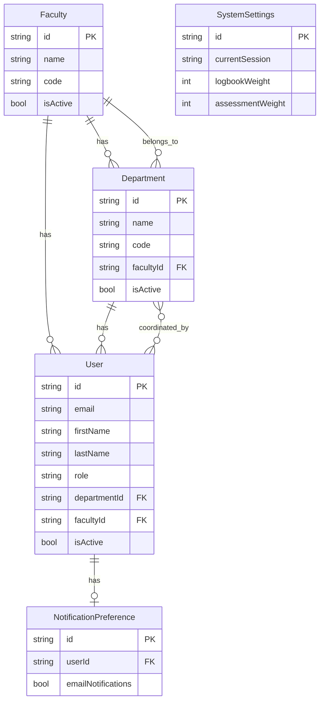

---

## Diagram 2 — Student & Placement

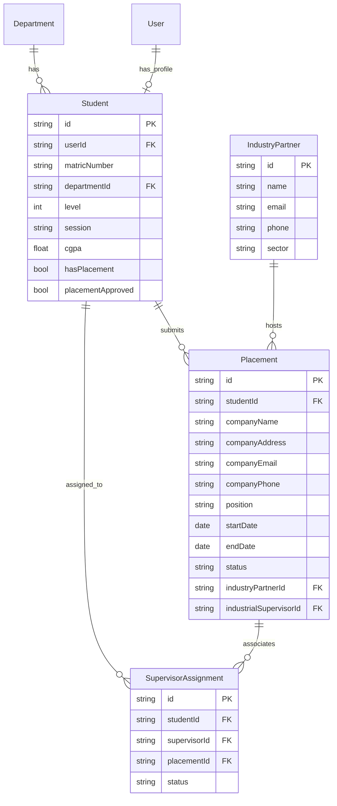

---

## Diagram 3 — Supervisor & Assessments

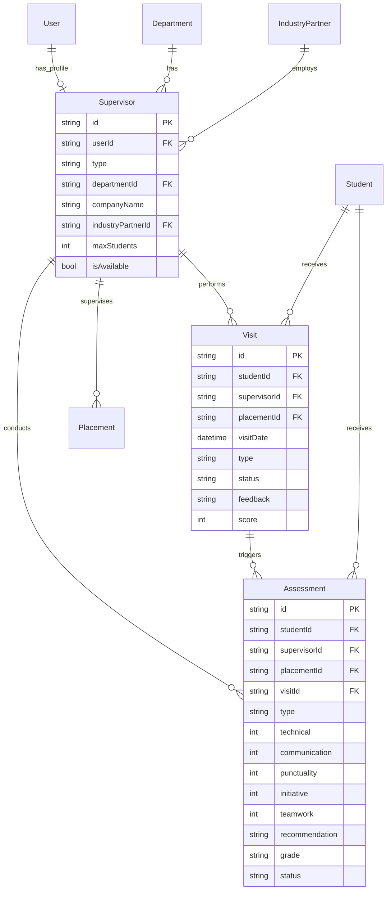

---

## Diagram 4 — Logbook & Reviews

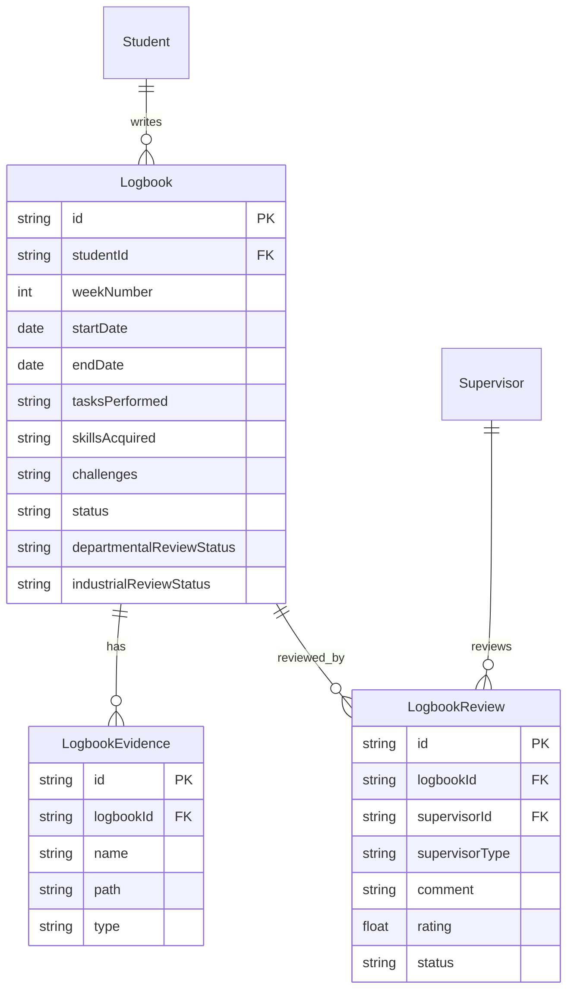

---

## Diagram 5 — Attendance

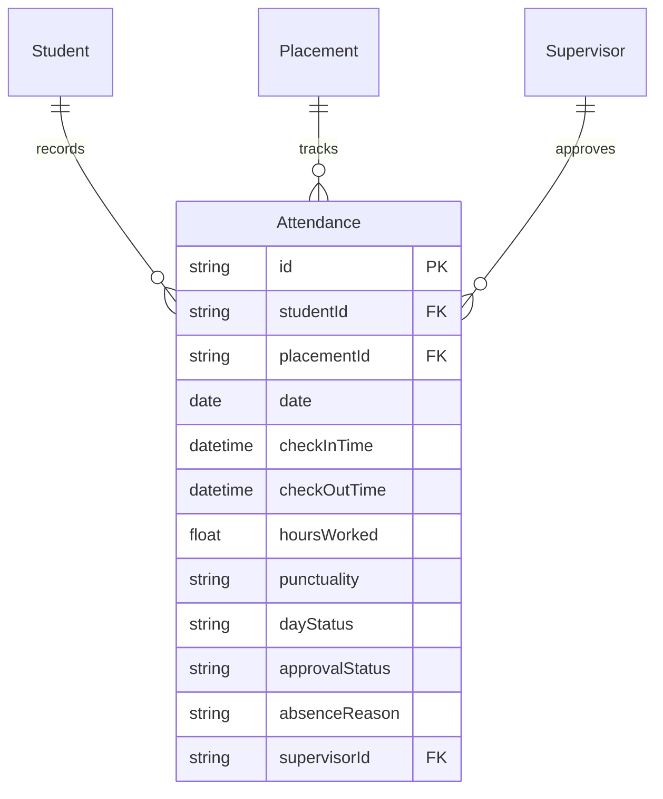

---

## Diagram 6 — Compliance & Reports

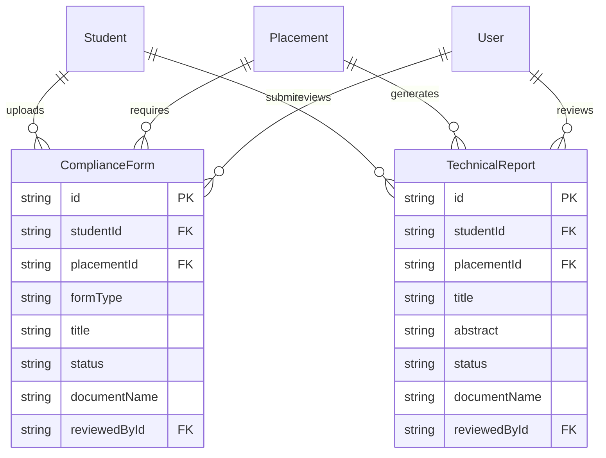

---

## Diagram 7 — Notifications & Invitations

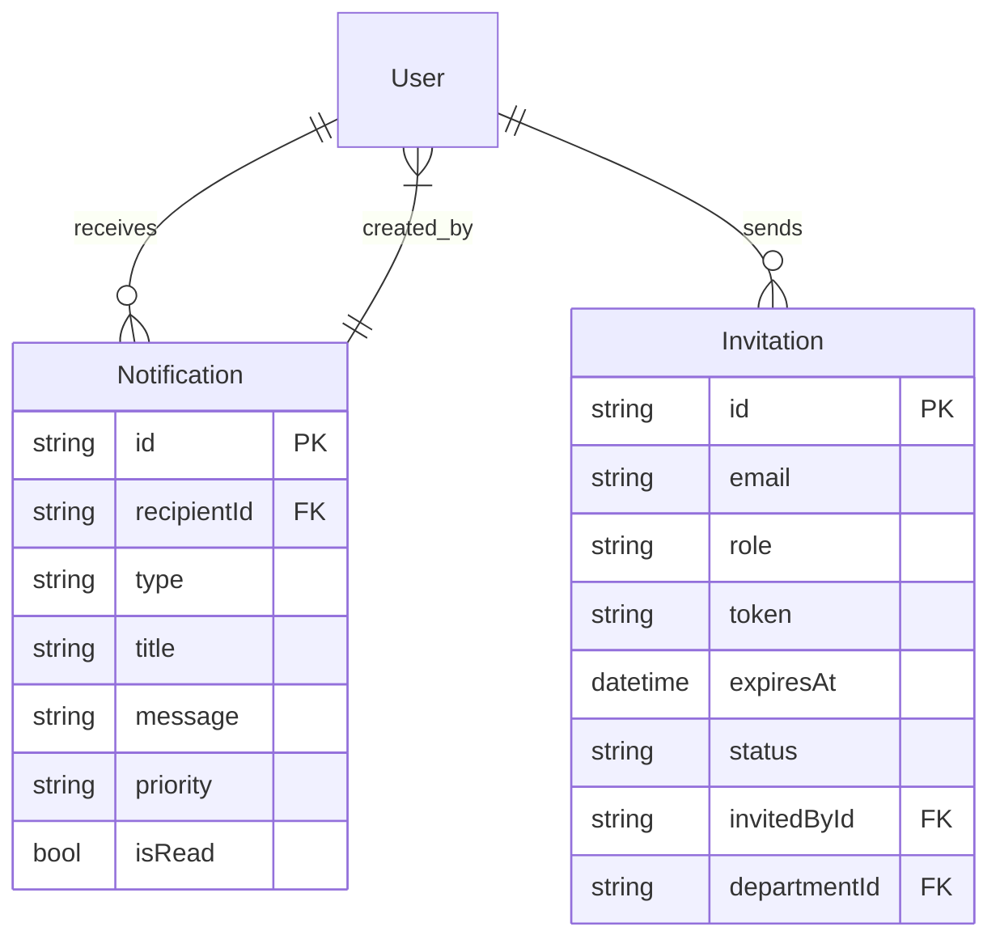

---

---

## System Flowcharts

> Split by role/domain for easy screenshotting.

---

### Flowchart 1 — Authentication & Onboarding

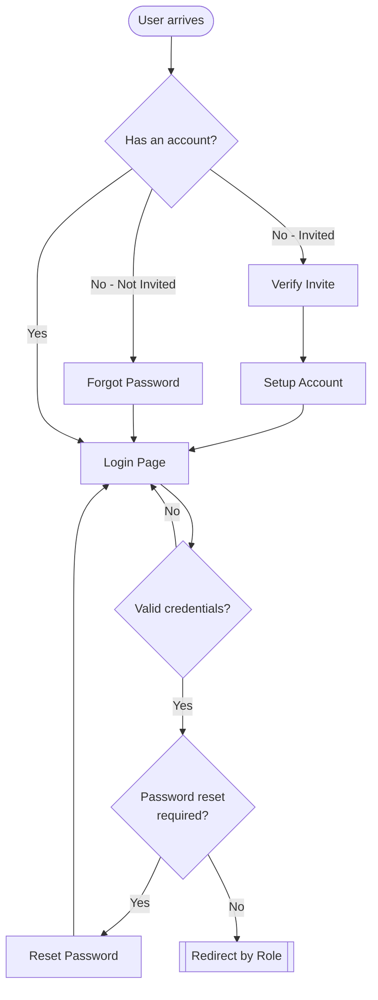

---

### Flowchart 2 — Admin

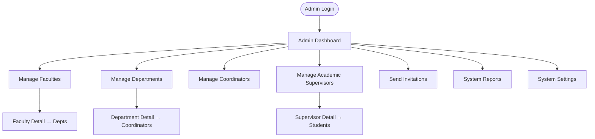

---

### Flowchart 3 — Coordinator

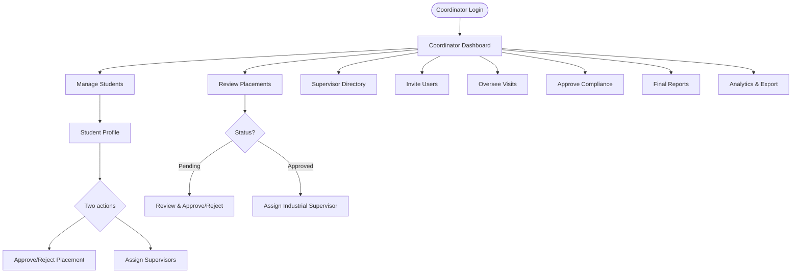

---

### Flowchart 4 — Student

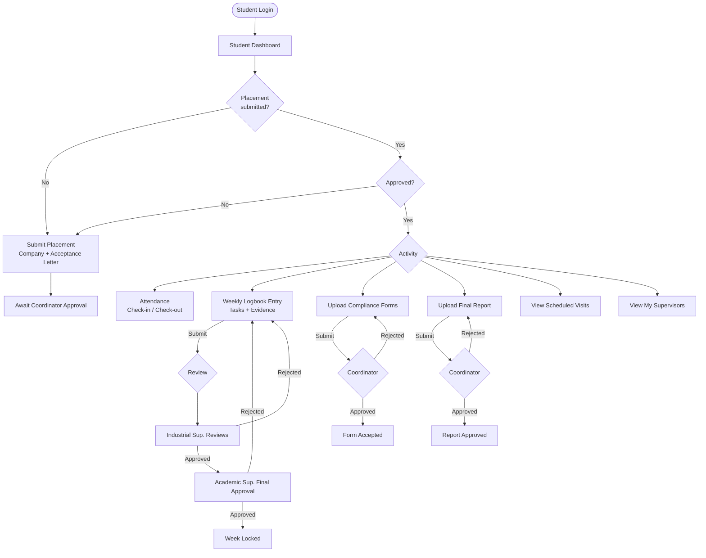

---

### Flowchart 5 — Academic / Departmental Supervisor

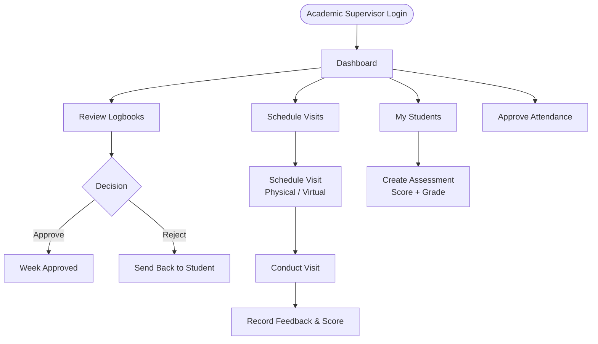

---

### Flowchart 6 — Industrial Supervisor

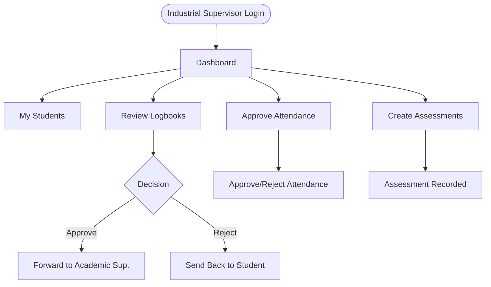

---

## Deployment Architecture Diagram

> **ChatGPT prompt (paste this into ChatGPT to generate the image):**
>
> Generate a clean deployment architecture diagram as an SVG with white background and no fill. Use black thin borders (1px), black text, Arial font, 11pt. The layout is horizontal from left to right.
>
> Boxes to include:
> - **CLIENT LAYER** (group box): contains "Browser / Mobile App" and "PWA Service Worker"
> - **RENDER.COM** (group box): contains "Frontend" box with "Next.js :3000", and "Backend" box with "Express :10000", "Socket.io", "JWT Auth"
> - **DATA LAYER** (group box): contains cylinder icon "PostgreSQL" and "Local Uploads" folder
> - **Cloudinary** (standalone component)
> - **Brevo / SendGrid** (standalone component)
>
> Arrows with black thin lines:
> - Browser/Mobile App → Next.js
> - PWA Service Worker → Next.js
> - Next.js → Express (label: HTTP/REST)
> - Next.js → Cloudinary
> - Express → JWT Auth → PostgreSQL, Local Uploads, Brevo/SendGrid
> - Socket.io ↔ Browser/Mobile App
> - Socket.io → Next.js

---

## High-Level Three-Tier Architecture

> **ChatGPT prompt (paste this into ChatGPT to generate the image):**
>
> Generate a clean three-tier architecture diagram as an SVG with transparent background, no fill, black thin borders (1px), black text, Arial 11pt. Layout is vertical with three horizontal tiers stacked top to bottom.
>
> **Tier 1 — PRESENTATION LAYER (top):**
> Group box containing "Browser / Mobile App (Next.js)", "PWA Service Worker", "Admin Dashboard", "Student Portal", "Coordinator Panel". Styled as client-side boxes.
>
> **Tier 2 — APPLICATION LAYER (middle):**
> Group box containing "Express API Server (REST)", "Authentication & JWT Middleware", "Socket.io Real-time", "Business Logic: Placements, Logbooks, Assessments, Reports". Styled as server-side boxes.
>
> **Tier 3 — DATA LAYER (bottom):**
> Group box containing cylinder icon "PostgreSQL Database (Prisma ORM)", folder icon "File Uploads (Local / Cloudinary)", and "Email Service (Brevo/SendGrid)". Styled as data-store boxes.
>
> **Arrows (black thin lines):**
> - Vertical arrows from Presentation Layer down to Application Layer (label: HTTP REST API)
> - Vertical arrows from Application Layer down to Data Layer (label: Queries / ORM)
> - Bidirectional arrow between Browser/Mobile App and Socket.io (label: WebSocket)
>
> Label each tier clearly in bold at the top-left of its group box. — End-to-End

> **ChatGPT prompt (paste this into ChatGPT to generate the image):**
>
> Generate a vertical swimlane/activity diagram as an SVG with transparent background, no fill, black thin borders (1px), black text, Arial 11pt. Each swimlane is a bordered box labeled at the top and contains steps connected by arrows.
>
> **Swimlane 1 — SETUP:** Admin creates Faculties & Departments → Admin invites Coordinators → Coordinator invites Students & Supervisors
>
> **Swimlane 2 — ONBOARDING:** Student receives invitation → Student sets up account → Student logs in
>
> **Swimlane 3 — PLACEMENT:** Student submits placement details → Coordinator reviews placement → diamond decision (Approved?) — Yes arrow leads to "Supervisors assigned", No arrow loops back to "Student submits placement details"
>
> **Swimlane 4 — TRAINING:** Student checks in daily → Student submits weekly logbook → Industrial supervisor reviews → Academic supervisor approves → Student uploads compliance forms → Coordinator approves
>
> **Swimlane 5 — EVALUATION:** Supervisor schedules visit → Visit conducted → Assessments scored → Final grade calculated
>
> **Swimlane 6 — COMPLETION:** Student submits final report → Coordinator reviews report → diamond decision (Approved?) — Yes arrow leads to "Training marked complete" then "Records archived", No arrow loops back to "Student submits final report"
>
> Connect the swimlanes sequentially (SETUP → ONBOARDING → PLACEMENT → TRAINING → EVALUATION → COMPLETION) with a downward arrow between them.

---

## Stakeholder Interaction Diagram

> **ChatGPT prompt (paste this into ChatGPT to generate the image):**
>
> Generate a stakeholder interaction diagram (use case style) as an SVG with transparent background, no fill, black thin borders and lines (1px), black text, Arial 11pt. Layout: actors at the top (horizontal row), use case boxes below them, with straight connector lines.
>
> **Actors (top row, left to right):** Admin, Coordinator, Student, Academic Supervisor, Industrial Supervisor (use stick figures)
>
> **Use case boxes (below, arranged in rows):**
> - System Config, Invitations, User Management, Reports & Analytics
> - Placements, Logbooks, Attendance, Student Assessment
>
> **Connections (lines between actors and use cases):**
> - Admin → System Config, Reports, Invitations, User Management
> - Coordinator → Placements, Reports, Invitations, User Management
> - Student → Placements, Logbooks, Attendance
> - Academic Supervisor → Logbooks, Student Assessment, Attendance
> - Industrial Supervisor → Logbooks, Student Assessment, Attendance

---

### Flowchart 7 — Notifications & Settings (Cross-Cutting)

> **ChatGPT prompt (paste this into ChatGPT to generate the image):**
>
> Generate a simple flowchart as an SVG with transparent background, no fill, black thin borders (1px), black text, Arial 11pt. The flow is top-to-bottom.
>
> **Steps (in order):**
> 1. Rounded box "System Event"
> 2. Arrow down to rectangle "Notification Engine"
> 3. Arrow down to diamond decision "Type?" with three branches:
>    - "In-App" → rectangle "In-App Alert"
>    - "Email" → rectangle "Email Sent"
>    - "Push" → rectangle "Push Notification"
> 4. All three branches merge into diamond decision "User Opt-in?" with two branches:
>    - "Yes" → rounded box "Delivered"
>    - "No" → rounded box "Suppressed"
> 5. Both branches end.
